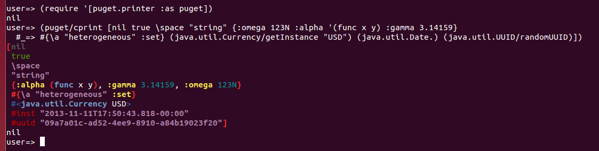

Puget
=====

[](https://circleci.com/gh/greglook/puget)
[](https://coveralls.io/github/greglook/puget?branch=develop)
[](https://greglook.github.io/puget/api/)
[](https://greglook.github.io/puget/marginalia/uberdoc.html)

Puget is a Clojure library for printing Clojure and
[EDN](https://github.com/edn-format/edn) values. Under the hood, Puget formats
data into _print documents_ and uses
[fipp](https://github.com/brandonbloom/fipp) to render them.



Puget offers several features which set it apart from FIPP and Clojure's native
pretty-printing functions. [Syntax coloring](#syntax-coloring) is the most
widely used, followed by [canonical printing](#canonical-representation). Custom
value rendering is supported using type dispatch to select [print
handlers](#type-extensions).

## Installation

Puget releases are published on Clojars. To use the latest version with
Leiningen, add the following dependency to your project definition:

[](http://clojars.org/mvxcvi/puget)

See [Whidbey](https://github.com/greglook/whidbey) for nREPL and Leiningen integration.

## Usage

Puget's printing is controlled by a map of options which configure things like
print width, sorting mode, color scheme and style, whether to print metadata,
and so on. The default options are held in the dynamic var
`puget.printer/*options*`, which can be bound using `with-options`. See the
[`puget.printer`](https://greglook.github.io/puget/api/puget.printer.html)
namespace documentation for the full set of options.

These options are used to construct a _printer_ to render values with. `pprint`
and `pprint-str` will automatically create a `PrettyPrinter` record from the
current and passed options, or you can use `pretty-printer` or
`canonical-printer` to construct one manually. `render-out` and `render-str`
take a printer and a value if you need maximum control over the printing.

## Syntax Coloring

Puget's first major feature is colorizing the printed data by rendering it with
embedded markup. Different syntax elements are given different colors to make
the printed output much easier for humans to parse. This is similar to syntax
highlighting, but much easier since the code works directly with the data
instead of parsing it from text!

Elements are mapped to color codes by the `:color-scheme` option. The
`:print-color` option can be set to enable colorization using the `with-color`
macro - alternately, the `cprint` function always prints with colored output
enabled.

Puget supports three different kinds of color markup:
- `:ansi` (the default) adds ANSI color escapes for terminal outputs.
- `:html-inline` adds HTML `span` elements with inline `style` attributes.
- `:html-classes` adds `span` elements with semantic `class` attributes.

See the [`puget.color.ansi`](src/puget/color/ansi.clj) namespace for the
available ANSI color styles which can be applied to syntax elements.

## Canonical Representation

Puget also provides _canonical serialization_ of data. In most cases, if two
data values are equal, they should be printed identically. This is important for
when the printed data is hashed, but it also makes it easier to process maps and
other structures with similar contents.

Puget uses the [arrangement](https://github.com/greglook/clj-arrangement)
library to sort the values in sets and the keys in maps so they are always
printed the same way. This can be disabled with the `:sort-keys` option, or
enabled only for collections under a certain size.

Most printing is done with the `PrettyPrinter` class, but the library also
offers the `CanonicalPrinter` for serializing data in a stricter (and more
compact) fashion.

```clojure
=> (require '[puget.printer :as puget])

=> (puget/pprint #{'x :a :z 3 1.0})
#{1.0 3 :a :z x}

=> (def usd (java.util.Currency/getInstance "USD"))
#'user/usd

=> (puget/pprint usd)
#<java.util.Currency@4cc4ee24 USD>

=> (puget/render-out (puget/canonical-printer) usd)
; IllegalArgumentException: No defined representation for class java.util.Currency: USD
```

## Type Extensions

All of Clojure's primitive types are given their standard print representations.
To handle non-standard data types, Puget supports a mechanism to dispatch to
custom _print handlers_. These take precedence over the normal rendering
mechanisms.

This can be used to provide an EDN tagged-literal representation for certain
types, or just avoid trying to pretty-print types which the engine struggles
with (such as Datomic database values).

Before rendering a value, the printer checks for a `:print-handlers` function.
If available, it is called with the type of the value to be printed. If the
lookup returns a handler, that function is called with the value and the result
is used as the rendered format of the value.

The [`puget.dispatch`](https://greglook.github.io/puget/api/puget.dispatch.html)
namespace has functions to help build handler lookup functions. The
`inheritance-lookup` constructor provides semantics similar to Clojure's
multimethod dispatch.

As an example, extending `#inst` formatting to clj-time's `DateTime`:

```clojure
=> (require '[clj-time.core :as t]
            '[clj-time.format :as f])

=> (puget/pprint (t/now))
#<org.joda.time.DateTime 2014-05-14T00:58:40.922Z>

=> (def time-handlers
     {org.joda.time.DateTime
      (puget/tagged-handler
        'inst
        (partial f/unparse (f/formatters :date-time)))})
#'user/time-handlers

=> (puget/pprint (t/now) {:print-handlers time-handlers})
#inst "2014-05-14T01:05:53.885Z"
```

If no handler is specified for a given type and it's not a built-in EDN type,
Puget refers to the `:print-fallback` option, which must be one of:
- `:pretty` (the default) prints a colored representation of the unknown value
  (not valid EDN!).
- `:print` falls back to the standard `pr-str` representation.
- `:error` throws an exception for types with no defined representation.
- A function which will be called with the printer and the unknown value to
  render, returning the formatted value.

## License

This is free and unencumbered software released into the public domain.
See the UNLICENSE file for more information.
